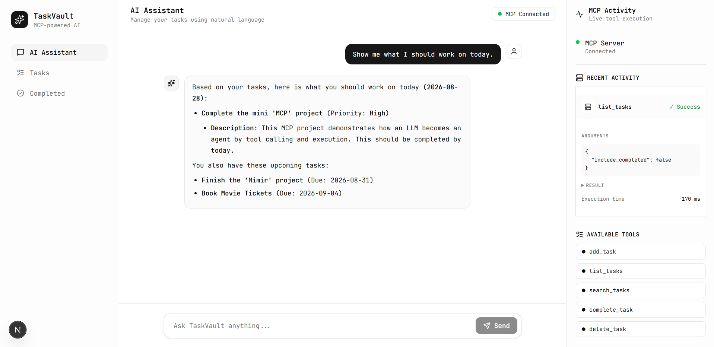
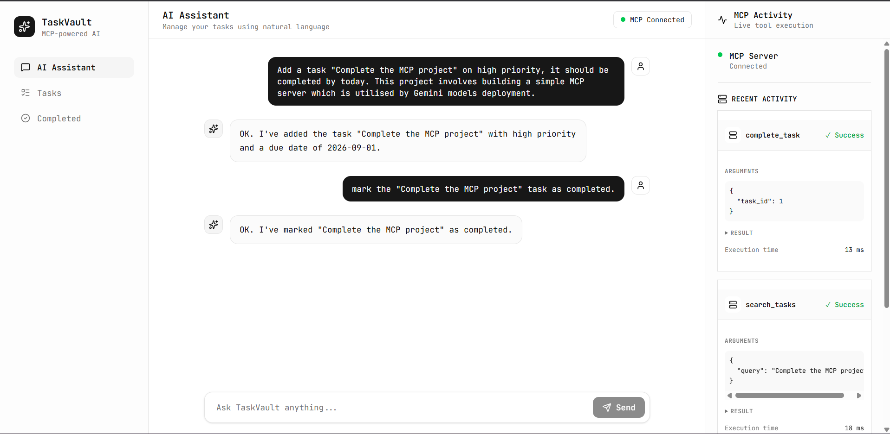
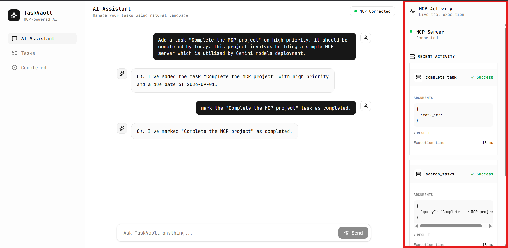
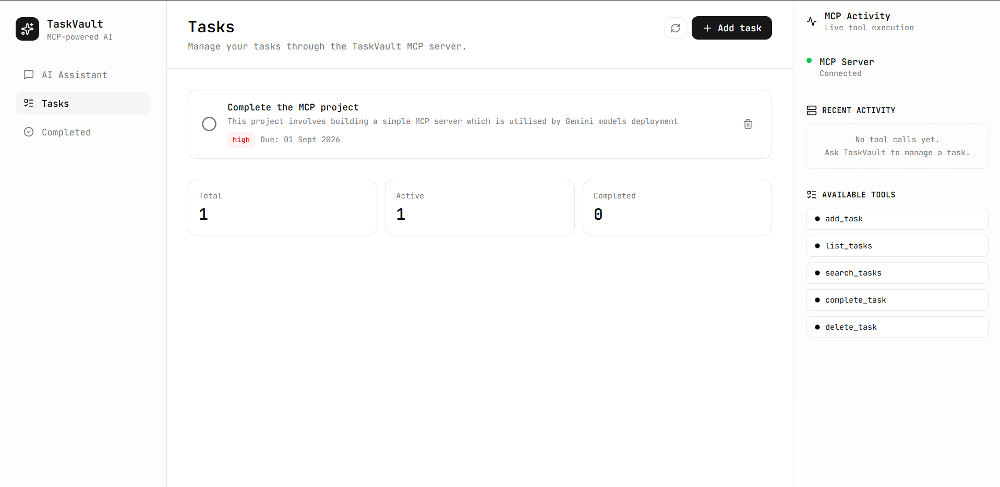
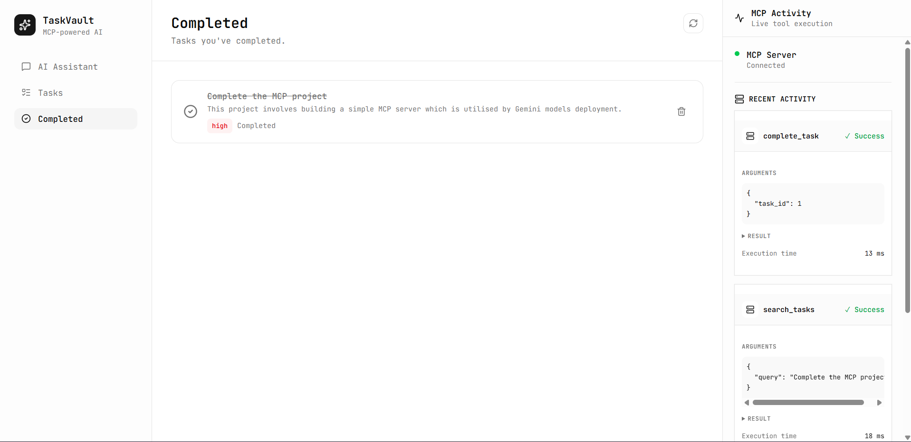

# TaskVault

**TaskVault is an AI-powered task management application that lets you
manage tasks using natural language through an MCP-based agent
architecture.**

The project combines a **Next.js frontend**, **FastAPI backend**,
**Google Gemini**, a custom **Model Context Protocol (MCP) server**, and
**SQLite**. The application is fully containerized with Docker and
deployed on Render.

---

## Overview

TaskVault turns ordinary task-management requests into tool calls.

Instead of manually navigating forms, you can ask:

> "Show me what I should work on today."

> "Add a high priority task called Finish learning Data Structures
> tomorrow."

> "Complete the Finish learning Data Structures task."

> "Could you delete my completed tasks?"

The AI agent determines which MCP tool is required, executes it through
the MCP server, and uses the result to produce a natural-language
response.

The interface also exposes the tool execution process through the **MCP
Activity** panel, making the agent's actions visible rather than hiding
them behind the chat interface.

---

## Features

- Natural-language task management
- AI-powered task planning and prioritization
- MCP-based tool discovery and execution
- Create, list, search, complete, and delete tasks
- Separate active and completed task views
- Live MCP tool activity panel
- Tool arguments, results, execution status, and execution time
- SQLite persistence
- Dockerized full-stack application
- Environment-based configuration
- Deployed frontend and backend

---

## Architecture

```text
                    ┌──────────────────────┐
                    │      Next.js UI      │
                    │                      │
                    │  AI Assistant        │
                    │  Tasks               │
                    │  Completed           │
                    │  MCP Activity        │
                    └──────────┬───────────┘
                               │ HTTP
                               ▼
                    ┌──────────────────────┐
                    │      FastAPI         │
                    │      Backend         │
                    │                      │
                    │   /api/chat          │
                    │   /api/tools/*       │
                    └──────────┬───────────┘
                               │
                               ▼
                    ┌──────────────────────┐
                    │    TaskVault Agent   │
                    │                      │
                    │   Google Gemini      │
                    │   Tool selection     │
                    │   Agent loop         │
                    └──────────┬───────────┘
                               │
                               │ stdio
                               ▼
                    ┌──────────────────────┐
                    │     MCP Server      │
                    │                      │
                    │ add_task             │
                    │ list_tasks           │
                    │ search_tasks         │
                    │ complete_task        │
                    │ delete_task          │
                    │ resources / prompts  │
                    └──────────┬───────────┘
                               │
                               ▼
                    ┌──────────────────────┐
                    │       SQLite         │
                    │       tasks.db       │
                    └──────────────────────┘
```

### Request flow

```text
User message
     ↓
Next.js frontend
     ↓
FastAPI /api/chat
     ↓
TaskVault Agent
     ↓
Gemini decides whether a tool is required
     ↓
MCP client
     ↓
MCP server
     ↓
Task tool
     ↓
SQLite
     ↓
Tool result returned to Gemini
     ↓
Natural-language response
     ↓
Frontend + MCP Activity panel
```

The important part of the architecture is that the LLM does **not**
directly manipulate the database.

The model selects from tools exposed by the MCP server, while the MCP
server owns the actual task operations.

---

## MCP Tools

Tool Purpose

---

`add_task` Create a new task
`list_tasks` List active tasks or include completed tasks
`search_tasks` Search tasks by title or description
`complete_task` Mark a task as completed
`delete_task` Delete a task

TaskVault also exposes an MCP resource for all tasks and a `plan_my_day`
MCP prompt.

---

## Tech Stack

### Frontend

- Next.js
- React
- TypeScript
- Tailwind CSS
- shadcn/ui
- Lucide React
- react-markdown

### Backend

- Python
- FastAPI
- Uvicorn
- Pydantic

### AI

- Google Gemini
- Google GenAI SDK

### Agent / Protocol

- Model Context Protocol (MCP)
- MCP stdio transport
- Function/tool calling

### Database

- SQLite

### DevOps / Deployment

- Docker
- Docker Compose
- Render

---

## Project Structure

```text
taskvault-mcp/
│
├── backend/
│   ├── main.py              # FastAPI application
│   └── mcp_client.py        # MCP tool bridge
│
├── frontend/
│   ├── src/
│   │   ├── app/
│   │   ├── components/
│   │   │   ├── assistant/
│   │   │   ├── layout/
│   │   │   ├── tasks/
│   │   │   └── ui/
│   │   └── lib/
│   │       └── api.ts
│   ├── Dockerfile
│   ├── package.json
│   └── ...
│
├── src/
│   └── taskvault/
│       ├── agent.py         # Gemini + MCP agent orchestration
│       ├── database.py      # SQLite operations
│       ├── models.py        # Task type definitions
│       └── server.py        # MCP server and tools
│
├── data/
│   └── tasks.db             # Local SQLite database
│
├── docker-compose.yml
├── requirements.txt
├── .env.example
├── .gitignore
└── README.md
```

---

## Running Locally

### Prerequisites

- Python 3.12+
- Node.js 22+
- Docker Desktop
- A Google Gemini API key

### 1. Clone the repository

```bash
git clone https://github.com/FanusAlameen/taskvault-mcp.git
cd taskvault-mcp
```

### 2. Configure environment variables

Create your environment file from the example:

```bash
cp .env.example .env
```

Configure the required values:

```env
MCP_LLM_KEY=your_gemini_api_key
MCP_LLM=your_gemini_model
TASKVAULT_DATA_DIR=/app/data
FRONTEND_URL=http://localhost:3000
```

### 3. Run with Docker

```bash
docker compose up --build
```

The application will be available at:

```text
Frontend: http://localhost:3000
Backend:  http://localhost:8000
API Docs: http://localhost:8000/docs
```

---

## SQLite Persistence

TaskVault uses SQLite for its task database.

When running with Docker, the database directory is mounted as a volume
so that rebuilding or restarting the container does not remove the task
data.

Conceptually:

```text
Docker container
      │
      │ mounted volume
      ▼
/app/data/tasks.db
```

This keeps the application simple while still providing persistence for
the deployed prototype.

---

### AI Assistant

The main interface allows tasks to be managed through natural language.



### Natural-Language Task Management

Tasks can be created and completed through conversational requests.



### MCP Activity

Every MCP tool execution is surfaced in the activity panel with its
arguments, result, status, and execution time.



### Tasks

The Tasks view provides a traditional interface for managing active
tasks.



### Completed Tasks

Completed tasks are separated into their own view.



---

## Deployment

TaskVault is deployed as two services on Render:

### Frontend

```text
https://taskvault-frontend-u0nu.onrender.com
```

### Backend

```text
https://taskvault-backend-kosu.onrender.com
```

The frontend communicates with the deployed FastAPI backend through the
configured environment variable.

For production deployments, configure the backend with the production
frontend origin for CORS and configure the frontend with the production
backend URL.

---

## Design Goals

TaskVault was built around a few simple principles:

### 1. Make AI actions visible

The MCP Activity panel shows what the agent actually did instead of
presenting the AI as a black box.

### 2. Keep the LLM away from the database

Gemini selects tools; the MCP server performs the actual task
operations.

### 3. Separate responsibilities

```text
Frontend
  → presentation and user interaction

FastAPI
  → HTTP/API boundary

Agent
  → LLM orchestration and tool-calling loop

MCP Server
  → task capabilities

SQLite
  → persistence
```

### 4. Keep the system easy to run

Docker provides a reproducible environment for the full application.

---

## What I Learned

This project was built to understand how an LLM application can move
beyond a simple prompt-and-response workflow.

Key concepts explored:

- LLM tool calling
- Agent loops
- MCP server architecture
- MCP client/server communication
- Dynamic tool discovery
- Structured tool results
- FastAPI API design
- Next.js application architecture
- SQLite persistence
- Dockerizing a full-stack application
- Environment-based configuration
- Deploying frontend and backend services

---

## Future Improvements

Potential next steps include:

- Streaming AI responses
- Authentication and user-specific task data
- PostgreSQL for production persistence
- Better conversation memory
- More sophisticated task planning
- Recurring tasks
- Task editing
- Notifications and reminders
- Additional MCP resources and prompts
- Local LLM support with Ollama
- Automated tests and CI/CD

---

## License

This project is licensed under the MIT License.

---

## Author

**Fanus M**

Built as a hands-on project exploring **AI agents, MCP, tool calling,
full-stack development, Docker, and deployment**.
